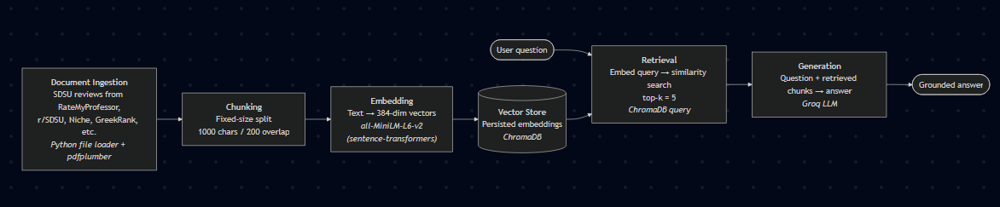

# Project 1 Planning: The Unofficial Guide

> Write this document before you write any pipeline code.
> Your spec and architecture diagram are what you'll use to direct AI tools (Claude, Copilot, etc.) to generate your implementation — the more specific they are, the more useful the generated code will be.
> Update the Retrieval Approach and Chunking Strategy sections if you change your approach during implementation.
> Update this file before starting any stretch features.

---

## Domain

<!-- What domain did you choose? Why is this knowledge valuable and hard to find through official channels? -->

The domain I chose is student life for San Diego State University. This knowledge is valuable because it allows people to understand what life may be like when they finally attend San Diego State University. This is also hard to find through official channels as the official channels will never talk about the downsides about student life as they want to seem the most desireable to prospective students.

---

## Documents

<!-- List your specific sources: URLs, subreddit names, forum threads, or file descriptions.
     Aim for at least 10 sources that together cover different subtopics or perspectives within your domain. -->

| # | Source | Description | URL or location |
|---|--------|-------------|-----------------|
| 1-5 | RateMyProfessor | A place where students can rate their professors to other students about the style that a professor teaches their course. Multiple professor pages will be used as sources from this website. | https://www.ratemyprofessors.com/ |
| 6 | r/SDSU | A subreddit dedicated for the students of and the community around San Diego State University to discuss San Diego State University | https://www.reddit.com/r/SDSU/ |
| 7 | Niche | A website dedicated to help prospective student and parents find out about the colleges they are going to and how they perform relative to other colleges | https://www.niche.com/colleges/san-diego-state-university/ |
| 8 | College Confidential | A Q&A forum board where prospective students can ask about the college they want to attend | https://talk.collegeconfidential.com/c/colleges-and-universities/san-diego-state-university/445 |
| 9 | Greek Rank | Rankings and reviews about the greek life at a university | https://www.greekrank.net/uni/69/greek-life/ |
| 10 | Unigo | Reviews about a specific college written by prospective and currently attending students | https://www.unigo.com/colleges/san-diego-state-university/reviews?utm_content=see-all-reviews&utm_term=/colleges/san-diego-state-university |

---

## Chunking Strategy

<!-- How will you split documents into chunks?
     State your chunk size (in tokens or characters), overlap size, and explain why those
     numbers fit the structure of your documents.
     A review-heavy corpus warrants different chunking than a long FAQ. -->

**Chunk size: 1000 characters**

**Overlap: 200 characters**

**Reasoning: Most posts made fall under the 1000 character mark, with some lengthy reviews hitting to this point. This means that we are not cramming too many conflicting shorter reviews (eg. reviews from RateMyProfessors) into one chunk, but making sure we still get the context from some longer reviews (eg. Unigo). The overlap is to ensure that the shorter reviews do not get split as they are as concise as possible and we want to keep what they are saying in mind. This fixed-sized character chunking will be the easiest to implement, so because of that, the overlap has to be large to get every review in context, even if it merges them together.**

---

## Retrieval Approach

<!-- Which embedding model are you using (e.g., all-MiniLM-L6-v2 via sentence-transformers)?
     How many chunks will you retrieve per query (top-k)?
     If you were deploying this for real users and cost wasn't a constraint, what tradeoffs
     would you weigh in choosing a different embedding model — context length, multilingual
     support, accuracy on domain-specific text, latency? -->

**Embedding model: all-MiniLM-L6-v2**

**Top-k: 5**

**Production tradeoff reflection: Some tradeoffs I would weigh in if I was deploying this for real users is choosing an embedding model that does not have such a limited input window. Especially when it comes to the longer reddit posts and reviews, I would definitely use a model with a higher input window when I change the chunking strategy to make sure one chunk is one review or one post. I would also consider using an API instead of a self-hosted model to speed up latency so that prospective students with lots of questions can rapid fire questions as they recieve new answers from this system.**

---

## Evaluation Plan

<!-- List your 5 test questions with their expected correct answers.
     Questions should be specific enough that you can judge whether the system's response
     is right or wrong. "What are good dining halls?" is too vague.
     "What do students say about wait times at [dining hall name] during lunch?" is testable. -->

| # | Question | Expected answer |
|---|----------|-----------------|
| 1 | "How big is greek life?" | "Greek life has an important presence within San Diego State University" |
| 2 | "How do students feel about the dorms?" | "Students have complaints over the dorms, but some indicate better housing second year" |
| 3 | "What is a good professor for my communications general education credit?" | "Micheal Rapp is a well-liked communications professor, having high praise from students according to his RateMyProfessor reviews" |
| 4 | "How is student life like outside of greek life?" | "Students communicate a great variety of clubs and sport activites are available outside of greek life, allowing oppurtunities for a good social life outside of greek life" |
| 5 | "How easy is it to get the classes I want?" | "Students report difficulty in obtaining the classes they want" |

---

## Anticipated Challenges

<!-- What could go wrong? Name at least two specific risks with reasoning.
     Consider: noisy or inconsistent documents, missing source attribution, off-topic
     retrieval, chunks that split key information across boundaries. -->

1. Chunks that contain multiple, short reviews with vastly differeing opinions. These can make the chunk incomprehensible as the context is wildly conflicting and ends up becoming totally useless, a key drawback of the fixed-character chunking strategy especially when it spans across platforms that have totally different kinds of posts (short concise reviews vs long detailed explanations)

2. Inconsistent documents, especially when trying to pull information from a page, such as RateMyProfessors, which can be loaded with ads and other irrelevant information for the purposes of this system.

---

## Architecture

<!-- Draw a diagram of your pipeline showing the five stages:
     Document Ingestion → Chunking → Embedding + Vector Store → Retrieval → Generation
     Label each stage with the tool or library you're using.
     You can use ASCII art, a Mermaid diagram, or embed a sketch as an image.
     You'll use this diagram as context when prompting AI tools to implement each stage. -->

---

## AI Tool Plan

<!-- For each part of the pipeline below, describe:
     - Which AI tool you plan to use (Claude, Copilot, ChatGPT, etc.)
     - What you'll give it as input (which sections of this planning.md, which requirements)
     - What you expect it to produce
     - How you'll verify the output matches your spec

     "I'll use AI to help me code" is not a plan.
     "I'll give Claude my Chunking Strategy section and ask it to implement chunk_text()
     with my specified chunk size and overlap" is a plan. -->

**Milestone 3 — Ingestion and chunking: I will try to have Claude build a webscraper that will extract the most relevant information for websites that do not have an API or save the HTML file and clean the HTML code into a simple text file with only the relevant information, and use the respective APIs for information otherwise. I will then feed this information into a chunking method to create chunks that will then be passed into the embedder.**

**Milestone 4 — Embedding and retrieval: I will pass this into the all-MiniLM-L6-v2 model which will transform the chunk into a 384-dimensional vector that can easily be stored in Chroma DB using an embedding function. I will use this same function on the user query and compare it to the vectors already stored in the database to find matches.**

**Milestone 5 — Generation and interface: I will pass the relevant chunks through the Groq API using a function with a system prompt to ensure the answer is generated mostly or completely from the chunks given and use Gradio as the interface.**
