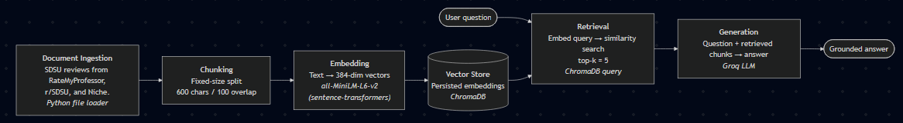

# Project 1 Planning: The Unofficial Guide

> Write this document before you write any pipeline code.
> Your spec and architecture diagram are what you'll use to direct AI tools (Claude, Copilot, etc.) to generate your implementation — the more specific they are, the more useful the generated code will be.
> Update the Retrieval Approach and Chunking Strategy sections if you change your approach during implementation.
> Update this file before starting any stretch features.

---

## Domain

<!-- What domain did you choose? Why is this knowledge valuable and hard to find through official channels? -->

The domain I chose is class/professor selection for introductory classes, as well as course selection in general. This is important because choosing the right courses will help set up the rest of the college career, especially when trying to graduate on time and having the highest quality classes with the best professors, helping prospective students have the best college life they can.

---

## Documents

<!-- List your specific sources: URLs, subreddit names, forum threads, or file descriptions.
     Aim for at least 10 sources that together cover different subtopics or perspectives within your domain. -->

| # | Source | Type | URL or file path |
|---|--------|------|-----------------|
| 1 | Joshua Bender Reviews | RateMyProfessors Reviews | https://www.ratemyprofessors.com/professor/3023005 |
| 2 | Micheal Rapp Reviews | RateMyProfessors Reviews | https://www.ratemyprofessors.com/professor/40278 |
| 3 | Patty Kraft Reviews | RateMyProfessors Reviews | https://www.ratemyprofessors.com/professor/96810 |
| 4 | San Diego State University Reviews | RateMyProfessors Reviews | https://www.ratemyprofessors.com/school/877 |
| 5 | Sharon Giles Reviews | RateMyProfessors Reviews | https://www.ratemyprofessors.com/professor/2373842 |
| 6 | Timothy Dunster Reviews | RateMyProfessors Reviews | https://www.ratemyprofessors.com/professor/1681 |
| 7 | San Diego State University Reviews | Niche Reviews | https://www.niche.com/colleges/san-diego-state-university/reviews/ |
| 8 | SDSU Honors College Value | r/SDSU | https://www.reddit.com/r/SDSU/comments/1ti8bnj/sdsu_webers_honor_college_worth_it_to_apply/ |
| 9 | Incoming Finance Major Classes to Take | r/SDSU | https://www.reddit.com/r/SDSU/comments/1t02qua/freshman_prerequisites_for_finance/ |
| 10 | Math Placement Test Questions | r/SDSU | https://www.reddit.com/r/SDSU/comments/1ttva6e/how_do_i_know_if_i_have_to_take_the_placement/ |

---

## Chunking Strategy

<!-- How will you split documents into chunks?
     State your chunk size (in tokens or characters), overlap size, and explain why those
     numbers fit the structure of your documents.
     A review-heavy corpus warrants different chunking than a long FAQ. -->

**Chunk size: 600 characters**

**Overlap: 100 characters**

**Reasoning: These sources are mostly short and concise reviews, only having 3-4 sentences maximum for the longest reviews. The extra character space is for metadata, which is especially helpful to determine how recent a review is made, and the overall score of the review. These both can help verify the accuracy of the review content, especially the more recent reviews which may be more representative of a professor's current style. The overlap exists for shorter comments and reviews that may still hold a complete thought, but do it in a very concise manner.**

---

## Retrieval Approach

<!-- Which embedding model are you using (e.g., all-MiniLM-L6-v2 via sentence-transformers)?
     How many chunks will you retrieve per query (top-k)?
     If you were deploying this for real users and cost wasn't a constraint, what tradeoffs
     would you weigh in choosing a different embedding model — context length, multilingual
     support, accuracy on domain-specific text, latency? -->

**Embedding model: all-MiniLM-L6-v2**

**Top-k: 5**

**Production tradeoff reflection: Some tradeoffs I would weigh in if I was deploying this for real users is choosing an embedding model that does not have such a limited input window. Especially when it comes to the longer reddit posts and reviews, I would definitely use a model with a higher input window when I change the chunking strategy to make sure one chunk is one review or one post. I would also consider using an API instead of a self-hosted model to speed up latency so that prospective students with lots of questions can rapid fire questions as they recieve new answers from this system.**

---

## Evaluation Plan

<!-- List your 5 test questions with their expected correct answers.
     Questions should be specific enough that you can judge whether the system's response
     is right or wrong. "What are good dining halls?" is too vague.
     "What do students say about wait times at [dining hall name] during lunch?" is testable. -->

| # | Question | Expected answer |
|---|----------|-----------------|
| 1 | "Should I apply to the Honors College?" | "Reddit users say that its not worth it" |
| 2 | "Should I worry about the placement test?" | "If you have prerequisite math courses, you do not need to worry. The chemistry placement test also works in a similar fashion." |
| 3 | "What is a good professor for my communications general education credit?" | "Micheal Rapp is a well-liked communications professor, having high praise from students according to his RateMyProfessor reviews" |
| 4 | "Who is a math professor I should avoid?" | "Students say that Timothy Dunster reads off the slides and the lectures are very boring." |
| 5 | "How easy is it to get the classes I want?" | "Students report difficulty in obtaining the classes they want" |

---

## Anticipated Challenges

<!-- What could go wrong? Name at least two specific risks with reasoning.
     Consider: noisy or inconsistent documents, missing source attribution, off-topic
     retrieval, chunks that split key information across boundaries. -->

1. Chunks that contain multiple, short reviews with vastly differeing opinions. These can make the chunk incomprehensible as the context is wildly conflicting and ends up becoming totally useless, a key drawback of the fixed-character chunking strategy especially when it spans across platforms that have totally different kinds of posts (short concise reviews vs long detailed explanations)

2. Inconsistent documents, especially when trying to pull information from a page, such as RateMyProfessors, which can be loaded with ads and other irrelevant information for the purposes of this system.

---

## Architecture

<!-- Draw a diagram of your pipeline showing the five stages:
     Document Ingestion → Chunking → Embedding + Vector Store → Retrieval → Generation
     Label each stage with the tool or library you're using.
     You can use ASCII art, a Mermaid diagram, or embed a sketch as an image.
     You'll use this diagram as context when prompting AI tools to implement each stage. -->

---

## AI Tool Plan

<!-- For each part of the pipeline below, describe:
     - Which AI tool you plan to use (Claude, Copilot, ChatGPT, etc.)
     - What you'll give it as input (which sections of this planning.md, which requirements)
     - What you expect it to produce
     - How you'll verify the output matches your spec

     "I'll use AI to help me code" is not a plan.
     "I'll give Claude my Chunking Strategy section and ask it to implement chunk_text()
     with my specified chunk size and overlap" is a plan. -->

**Milestone 3 — Ingestion and chunking: I will have Claude preprocess some txt files downloaded from the RateMyProfessors and Niche websites. For r/SDSU, I will use Reddit's API. I will then feed this information into a chunking method to create chunks that will then be passed into the embedder.**

**Milestone 4 — Embedding and retrieval: I will pass this into the all-MiniLM-L6-v2 model which will transform the chunk into a 384-dimensional vector that can easily be stored in Chroma DB using an embedding function. I will use this same function on the user query and compare it to the vectors already stored in the database to find matches.**

**Milestone 5 — Generation and interface: I will pass the relevant chunks through the Groq API using a function with a system prompt to ensure the answer is generated mostly or completely from the chunks given and use Gradio as the interface.**
